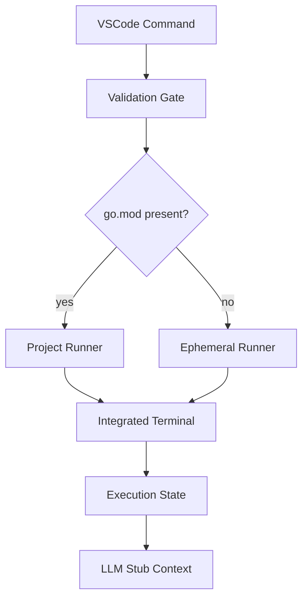

# Architecture

## Core modules

- `extension.ts`: command orchestration and runtime flow.
- `services/scriptEligibility.ts`: executable file checks (`package main`).
- `services/ephemeralRunner.ts`: ephemeral command sequence builder.
- `services/programArgs.ts`: quick-input argument parsing.
- `test/suite/*`: behavioral regression coverage.

## Structural decisions

1. Integrated Terminal as the primary execution channel.
2. Temporary cleanup enabled by default.
3. Dual validation (UI context + runtime command gate).
4. Local LLM/MCP stub in MVP.

## Logical flow



## Strategic V2: Interactive GoSetup

When Go is not found:

1. Fetch versions from `https://go.dev/dl/?mode=json`.
2. Parse `version` and remove `go` prefix.
3. Display options in `showQuickPick`.
4. Execute installation using Kubex Ecosystem GoSetup scripts.

Planned commands:

=== "Unix/Mac"

    ```bash
    bash -c "$(curl -sSfL 'https://raw.githubusercontent.com/kubex-ecosystem/gosetup/main/go.sh')" -s install <VERSION>
    ```

=== "Windows (PowerShell)"

    ```powershell
    # Equivalent flow using go.ps1
    # https://raw.githubusercontent.com/kubex-ecosystem/gosetup/main/go.ps1
    ```
