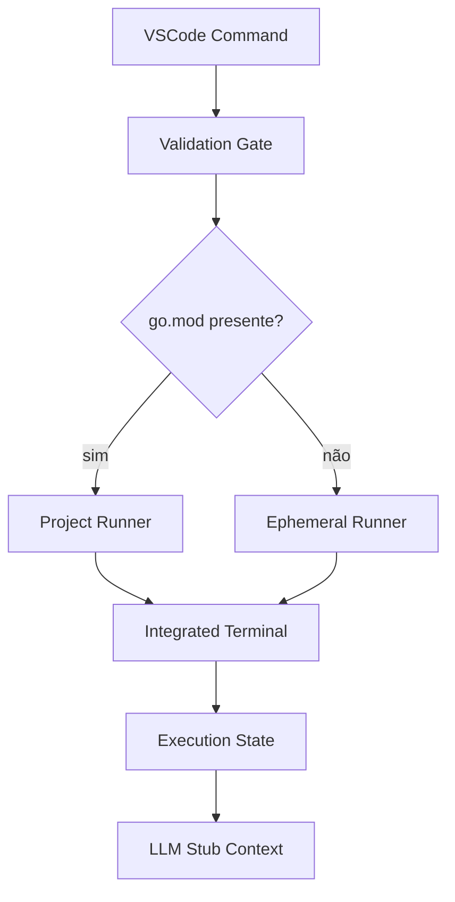

# Architecture

## Módulos principais

- `extension.ts`: orquestra comandos e fluxo geral.
- `services/scriptEligibility.ts`: valida arquivo executável (`package main`).
- `services/ephemeralRunner.ts`: define sequência de comandos efêmeros.
- `test/suite/*`: cobertura de comportamento crítico.

## Decisões estruturais

1. Terminal Integrado como canal principal de execução.
2. Limpeza de temporário habilitada por padrão.
3. Dupla validação (UI + runtime) para elegibilidade.
4. Stub LLM/MCP local no MVP.

## Diagrama lógico



## V2 estratégica: GoSetup Interativo

Quando Go não for encontrado:

1. Buscar versões em `https://go.dev/dl/?mode=json`.
2. Parsear `version` e remover prefixo `go`.
3. Exibir versões em `showQuickPick`.
4. Executar instalação via scripts GoSetup da Kubex Ecosystem.

Comandos previstos:

=== "Unix/Mac"

    ```bash
    bash -c "$(curl -sSfL 'https://raw.githubusercontent.com/kubex-ecosystem/gosetup/main/go.sh')" -s install <VERSAO>
    ```

=== "Windows (PowerShell)"

    ```powershell
    # Fluxo equivalente usando go.ps1
    # https://raw.githubusercontent.com/kubex-ecosystem/gosetup/main/go.ps1
    ```
