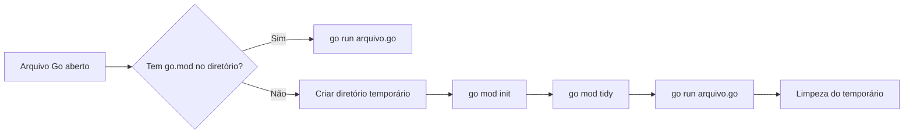

# RighToGo

RighToGo é uma extensão VSCode da Kubex Ecosystem para executar scripts Go de forma rápida, segura e com baixa fricção.

> Objetivo: permitir ciclos curtos de experimentação em Go, com ou sem projeto estruturado.

## O que resolve

- Evita setup manual de `go.mod` para arquivos soltos.
- Mantém execução interativa (stdin/stdout) via Terminal Integrado.
- Fornece validação de elegibilidade para evitar execução indevida de arquivos de biblioteca.
- Abre caminho para diagnósticos com LLM/MCP (stub no MVP).

## Fluxo em alto nível



## Comandos principais

- `RighToGo: Run Current Go Script`
- `RighToGo: Ask LLM About This Script`

## Build e documentação

=== "Extensão"

    ```bash
    pnpm install
    pnpm run compile
    pnpm test
    ```

=== "Doc-site"

    ```bash
    make build-docs
    make serve-docs
    ```

## Navegação rápida

- [Instalação](getting-started/installation.md)
- [Execução de arquivos](features/execution.md)
- [Configuração](guide/configuration.md)
- [Arquitetura](advanced/architecture.md)
- [Contribuição](about/contributing.md)
