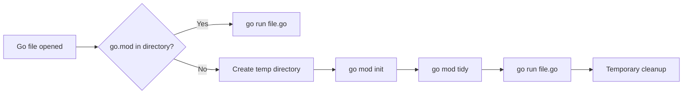

# RighToGo

RighToGo is a Kubex Ecosystem VSCode extension for running Go scripts quickly, safely, and with minimal setup friction.

> Goal: enable short Go experimentation cycles, with or without a full project structure.

## What it solves

- Avoids manual `go.mod` setup for standalone scripts.
- Keeps interactive execution (`stdin`/`stdout`) through the integrated terminal.
- Enforces eligibility checks to prevent incorrect execution of library files.
- Provides a path for LLM/MCP-assisted diagnostics (MVP stub).

## High-level flow



## Main commands

- `RighToGo: Run Current Go Script`
- `RighToGo: Run Current Go Script (With Args)`
- `RighToGo: Run Current Go Script (New Window)`
- `RighToGo: Ask LLM About This Script`

## Build and docs

=== "Extension"

    ```bash
    pnpm install
    pnpm run compile
    pnpm test
    ```

=== "Docs site"

    ```bash
    make build-docs
    make serve-docs
    ```

## Quick links

- [Installation](getting-started/installation.md)
- [File execution](features/execution.md)
- [Configuration](guide/configuration.md)
- [Architecture](advanced/architecture.md)
- [Contributing](about/contributing.md)
